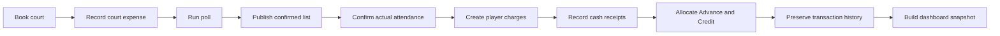

# Payment Lifecycle and Ledger Invariants

**Status:** Released rule set for technical build 1.0.10; production verified under ADS-18

**Formal release:** Version 1.0

**Scope:** Court expense, attendance charges, collection, Advance, Credit, history, persistence, and dashboard reporting

## Lifecycle



1. Booking records the venue, court count, times, court fee, shuttle fee, water cost, and expected capacity.
2. Poll responses and the published list are provisional. They do not create collectible charges.
3. Actual attendance is the charge basis after the session ends. Waiting-list players are not charged.
4. Each active attendee is charged for their own seat and guests. Organizer and co-organizer exemptions apply only to their own seat.
5. Cash receipts are recorded against player or payment-group balances. Cash above the remaining balance becomes Credit owned only by the payer.
6. Intentional Advance and overpayment Credit are separate funding types.
7. One canonical ledger snapshot supplies Sessions, Payments, Player Balances, group cards, histories, reminders, session completion, and Dashboard.

## Definitions

- **Court expense:** Amount paid to the venue for a session.
- **Charge:** Amount owed by one player for a session or activity.
- **Cash receipt:** New money received from a player or payment-group payer.
- **Advance:** Intentional prepayment recorded in the Advance section. It settles the payer's own charges first, then active members of saved groups for which that player is the payer.
- **Group Advance:** A payment-group payer's remaining intentional Advance allocated to active members of that saved group.
- **Credit:** Excess cash from a completed payment or an organizer-relative activity over-contribution. It belongs only to the player who created it.
- **Group Credit:** A payer's remaining Credit allocated to active members of a saved payment group.
- **Allocation:** Funding applied to a specific charge.
- **Outstanding:** Charge minus cash, own Advance, Group Advance, own Credit, and Group Credit.

## Allocation Order

The ledger applies funding in this order:

1. Recorded cash already allocated to the charge.
2. The debtor's intentional Advance, oldest charge first.
3. The debtor's own Credit, oldest charge first.
4. Remaining intentional Advance from the saved payment-group payer.
5. Remaining Credit from the saved payment-group payer.
6. New cash entered for an individual or group payment.

Group rules:

- Advance and Credit transfer only from the configured payer through an active saved payment group.
- A payer's Advance and Credit are each reserved once across all groups; neither can be shown as covering multiple balances simultaneously.
- Groups are processed in persisted creation order. Within a group, partial funding is split across member balances using the existing deterministic cent-safe split, then applied oldest charge first.
- Existing overlapping memberships are resolved once in persisted group order. New active overlaps must be rejected because payment responsibility would be ambiguous.
- Automatic Credit allocation is derived. It must never increase a charge's `paidAmount` or create a zero-cash transaction.
- New group cash applies only to the canonical remaining group balance. Any excess becomes Credit for the payer.

## Activity Settlement Contract

Activities use the Organizer selected in Settings as the settlement owner. That player is snapshotted on the activity so a later Settings change does not rewrite historical responsibility.

1. An activity has one or more unique payer contributions. Every contribution must be positive, and their exact currency total must equal the activity total.
2. Participants receive an allocated share using one of four modes:
   - Equal: divide the total evenly with deterministic cent rounding.
   - Manual: entered currency amounts must total the activity amount exactly.
   - Percentage: non-negative percentages must total 100 percent.
   - No. of Shares: each participant receives a positive whole-number weight.
3. For every non-organizer participant, the organizer-relative balance is:

```text
activity_balance = allocated_share - player_contribution
```

- Positive balance becomes Due to the Organizer.
- Negative balance becomes Credit owned by that player.
- Zero balance is Settled and produces neither Due nor Credit.

4. Activity-generated Credit enters the same owner-specific Credit ledger as payment overage. It can cover that player's later personal charges or eligible saved-group member charges, but ownership never transfers.
5. Editing an activity recalculates allocations from the updated total, payers, participants, and split. Existing receipts are preserved and reconciled; cash beyond the revised charge becomes payer Credit.
6. Deleting an activity removes its unpaid derived balances and activity-generated Credit. Existing receipts remain in history, and receipt cash no longer required by the deleted activity becomes payer Credit.
7. Legacy one-payer activities normalize to one contribution, Equal split, and the currently configured Organizer without changing their recorded cash history.

## Ledger Equations

For every charge:

```text
outstanding = max(0, charge - cash - own_advance - group_advance - own_credit - group_credit)
```

For every player:

```text
player_due = sum(player charge outstanding)
remaining_advance = advance_received - advance_applied_to_own_charges - group_advance_provided
remaining_credit = credit_created - own_credit_applied - group_credit_provided
```

For every cash transaction:

```text
cash_received = cash_applied + credit_created
```

Global controls:

```text
sum(group_credit_provided) = sum(group_credit_received)
sum(group_advance_provided) = sum(group_advance_received)
credit_applied <= credit_created
advance_applied <= advance_received
no allocation can exceed its charge outstanding
```

## Dashboard Contract

Dashboard values must come from the same ledger snapshot as operational pages.

| Metric | Source |
| --- | --- |
| Court Spent | Saved billable session court expenses |
| Gross Charges | Final attendee charges |
| Cash Applied | Cash allocations to charges |
| Advance Applied | Intentional Advance allocations |
| Credit Applied | Own and payment-group Credit allocations |
| Outstanding | Canonical charge outstanding |
| Available Advance | Unallocated intentional Advance |
| Available Credit | Unallocated overpayment Credit |
| Organizer Net | Player charges minus court, water, and shuttle expenses |

“Collected” must not silently mix cash, Advance, and Credit. Operational coverage and cash-flow reporting are distinct.

## History and Mutation Rules

- A payment event must retain payer, amount, date/time, funding type, covered players, charge allocations, and resulting Credit.
- Reversal must preserve an audit record and reverse the exact original allocations.
- The transaction trash dialog must offer two explicit outcomes for an active user receipt: Reverse undoes the exact allocations and retains a reversed audit row; Delete performs the same reversal and then removes that row.
- An already-reversed user receipt offers Delete only. Deleting it must not recalculate any balance or allocation. Migrated and adjustment audit records cannot be reversed or purged.
- A session, activity, or player with financial activity must not be hard-deleted while allocations reference it.
- Attendance, guest count, role, or rate changes after collection must not silently delete or resize a paid charge. They require a reconciled adjustment or reversal first.
- Payment method stored on a historical receipt must not change when the player's current preference changes.
- Backup import, cloud reload, and conflict recovery must reproduce the same ledger snapshot.

## Baseline Audit Findings

The baseline audit used the Version 1.0.3 implementation, its 95 regression tests, and the read-only backup `ad-smashers-backup-2026-07-13-2.json`. Every finding below is resolved in technical build 1.0.4.

| ID | Severity | Finding | Build 1.0.4 control |
| --- | --- | --- | --- |
| PAY-01 | Critical | Group Credit is only previewed on the group card. Sessions, player balances, reminders, session completion, and Dashboard retain the member due. | One canonical snapshot supplies every consumer. |
| PAY-02 | Critical | A zero-cash group action writes Credit into `paidAmount`, classifying Credit as cash. | Derived Credit never mutates cash or creates a zero-cash transaction. |
| PAY-03 | High | The same payer Credit can be reserved independently by multiple groups. AED 60 can display as covering AED 80. | Credit is reserved once globally in persisted group order. |
| PAY-04 | High | Attendance or roster changes can delete a paid charge and leave Credit or transaction data detached. | Active cash or derived coverage continues to block destructive roster changes; retained history blocks hard deletion. |
| PAY-05 | High | Charge corrections either retain excess receipt cash incorrectly or become impossible when only recalculable coverage exists. | Recorded cash and active transaction allocations require reversal or deletion; derived Advance and Credit automatically reflow through the canonical ledger. |
| PAY-06 | High | Individual payments are aggregated into the charge and do not retain one transaction per receipt. | Every receipt has an immutable timestamped transaction and exact allocations. |
| PAY-07 | High | Deleting a session can leave group transaction allocations pointing to a missing charge. | Retained transaction references block hard deletion after reversal. |
| PAY-08 | Medium | Adding Advance can make every payment effectively paid without updating the stored session stage or dashboard pipeline. | Canonical coverage synchronizes session stage and pipeline state. |
| PAY-09 | Medium | Multiple open Advance deposits are under-reported by the Advance summary. AED 300 can display as AED 200. | Advance summaries aggregate every active deposit and deduction. |
| PAY-10 | Medium | Schema and UI fields use `advance` to represent both intentional Advance and overpayment Credit. | Intentional Advance and overpayment Credit have separate ledger and UI semantics. |
| PAY-11 | Medium | Firestore writes can span multiple commits; the workspace version document is written in the first chunk, so a later chunk failure can expose a partial save. | Saves reject more than 500 writes before commit and never expose a partial workspace version. |

Backup-specific evidence:

- Yogesh has AED 122 gross Credit.
- Yogesh's own AED 40 due uses the first AED 40.
- The active group applies the next AED 40 to Abhineya's two collectible sessions: AED 15 on 10 July and AED 25 on 11 July.
- Yogesh retains AED 42 Credit; Yogesh and Abhineya each have AED 0 outstanding.
- Dashboard separates AED 2,334.63 cash, AED 212 Advance applied, AED 153 Credit applied, AED 122 session dues, and AED 17 activity dues.
- The backup's six stored payment transactions balance internally and contain no dangling allocations. The original inconsistency was calculation behavior, not damaged backup data.

## Build 1.0.4 Verification

| Gate | Evidence |
| --- | --- |
| Automated regression | 108 tests pass, including allocation, overlap, ownership, reversal, reload, dashboard, atomic save, and mobile layout controls. |
| Build | `npm run build` synchronizes all shell, manifest, service-worker, and hosting assets to 1.0.4. |
| Backup integrity | Source and disposable copies share SHA-256 `9d386804affd5fde246be57963f370d25a0d592bb52bcce1f971a615a3f30b5f`. |
| Backup replay | 27 players, 11 sessions, 5 activities, 3 groups, and 6 transactions migrate with zero invariant violations. |
| Receipt lifecycle | A local AED 5 receipt reduced Abhirami from AED 25 to AED 20, survived reload, reversed to AED 25, and retained a reversed transaction. |
| Cross-surface results | Group, sessions, player balances, histories, reminders, stages, and Dashboard agree with the canonical snapshot. |
| Responsive QA | At 390 x 844, document width is 390 with no overflow, out-of-bounds element, clipped text, or overlapping balance/action controls. |
| Isolation and cleanup | Local-only credentials and same-origin CSP were used; storage, service workers, caches, cookies, temporary files, and the test port were cleared. |

## Build 1.0.8 Verification

| Gate | Evidence |
| --- | --- |
| Automated regression | 145 tests pass, including payer ownership, group Advance/Credit, receipt Delete/Reverse, multi-payer activities, all split modes, edit/delete reconciliation, performance, and responsive controls. |
| Build | `npm run build` synchronized the application, manifest, service-worker cache, and Hosting assets to 1.0.8. |
| Restore point | `ad-smashers-backup-2026-07-19.json`, 155752 bytes, SHA-256 `a55df6d03c358c56378bda91a4130ac69e49c922997294cae19e71905ce4417d`. |
| Backup replay | Latest production data was replayed in a local-only QA context without Firebase writes or persistent test records. |
| Cross-surface results | Sessions, activities, payment groups, Player Balances, histories, Dashboard, Advance, and Credit use one canonical ledger snapshot. |
| Responsive QA | Desktop, 390 x 844, and 320 x 760 passed with split icons in one row, no horizontal overflow, and no browser errors. |
| Release integrity | Approved candidate tree equals merged source `134b621`; GitHub CI passed on PR #18. |
| Production | Firebase Hosting only; HTTP 200, live version 1.0.8, active service worker, and no smoke-test errors. |

## Build 1.0.10 Verification

| Gate | Evidence |
| --- | --- |
| Automated regression | 149 tests pass, including derived Advance, payment-group Credit, recorded cash, active transaction allocation, roster protection, history, and canonical coverage. |
| Build | `npm run build` synchronized the application, manifest, service-worker cache, and Hosting assets to 1.0.10. |
| Restore point | `ad-smashers-backup-2026-07-24.json`, 187362 bytes, SHA-256 `35dfb617e5abeaadcccde40e8104a222eac11819d4a65a64c5bd0714da192606`. |
| Backup replay | The 23 July session defect reproduced in a local-only context with production writes disabled. |
| Corrected behavior | Derived Advance/Credit recalculates after a session correction; recorded cash and active transaction allocations still block financial-basis mutation. |
| Release integrity | Approved candidate and merged `main` trees match; GitHub CI passed on PR #21. |
| Production | Firebase Hosting released 22 files; live `APP_VERSION` is 1.0.10; no Firestore component was deployed. |
| Cleanup | Browser storage, service worker, caches, temporary files, and port 4173 were cleared. |

Production deployment and smoke-test evidence are recorded in Jira and Confluence for Version 1.0.
