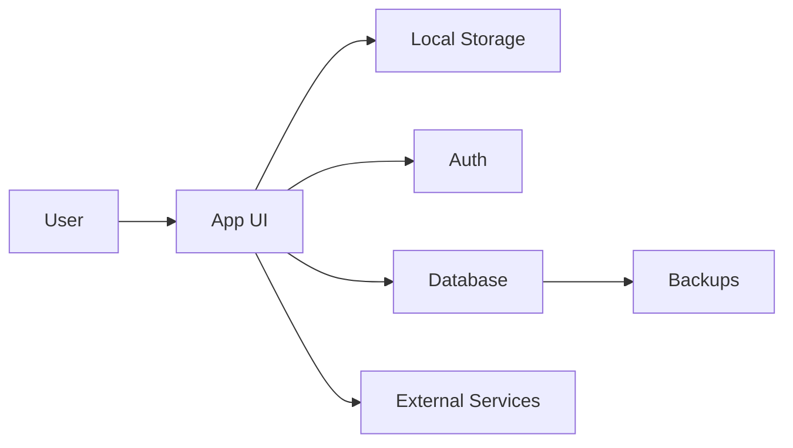

# Threat Model

## System Overview

## Assets

- player identity and contact records
- attendance, guest, and racket-needed history
- payment, advance-credit, activity, and shuttle ledgers
- Firebase authentication sessions and membership roles
- backups and release artifacts
- integrity of `main`, production tags, Firestore rules, and deployed files

## Trust Boundaries

- browser to cloud
- app to external services
- export/import files
- admin vs non-admin users

## Main Threats

| Threat | Impact | Likelihood | Mitigation | Test |
| --- | --- | --- | --- | --- |
| Unauthorized read | High | Medium | Firebase Auth, active-member checks, least-privilege roles, no live data in Git | Auth/rules regression and anonymous/non-member denial |
| Unauthorized write | High | Medium | Owner/admin/editor write roles, version preconditions, audit metadata | Rules tests, stale-write and role tests |
| Data loss or stale overwrite | High | Medium | Pending journal, optimistic versioning, backup/export, conflict replay | Load/save/conflict/backup regression |
| XSS or unsafe rendering | High | Medium | Escaping helpers, URL normalization, synthetic malicious-input tests | Injection regression across cards/modals/messages |
| Unsafe external action | Medium | Medium | Allowlisted/normalized map, WhatsApp, phone, and Playo destinations | External-navigation matrix |
| Secret or personal-data exposure | High | Medium | Public-repo boundary, ignore rules, no service accounts, secret/history scan, private vulnerability reporting | Pre-publication/release exposure audit |
| Public source reconnaissance | Medium | High | Assume code/config/rules are known; enforce security server-side in Auth/Firestore rules | Anonymous/non-member API attempts |
| Supply-chain or workflow compromise | High | Low | Minimal dependencies, pinned major GitHub Actions, read-only workflow permissions, protected `main` | CI run, workflow review, branch-protection API readback |
| Destructive merge or history rewrite | High | Low | PR requirement, CI, linear history, no force push/deletion, squash merge | Protected-branch readback and controlled PR test |

## Release Blockers

- any password, token, private key, service account, backup, or live personal/financial data found in Git or workflow logs
- anonymous/non-member Firestore access succeeds
- `main` is public but lacks active protection and required CI
- failed P0/P1 security, data-integrity, backup, or recovery regression
- deployed version cannot be tied to an immutable reviewed commit/tag
