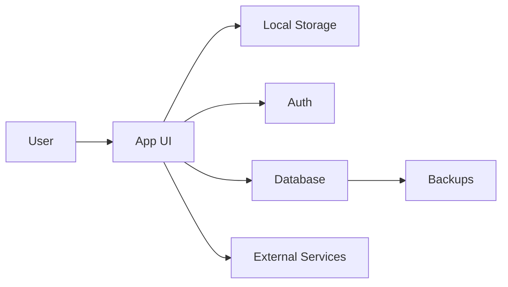

# Threat Model

## System Overview

## Assets

- 

## Trust Boundaries

- browser to cloud
- app to external services
- export/import files
- admin vs non-admin users

## Main Threats

| Threat | Impact | Likelihood | Mitigation | Test |
| --- | --- | --- | --- | --- |
| Unauthorized read | TBD | TBD | TBD | TBD |
| Unauthorized write | TBD | TBD | TBD | TBD |
| Data loss | TBD | TBD | TBD | TBD |
| XSS/unsafe rendering | TBD | TBD | TBD | TBD |
| Bad automation action | TBD | TBD | TBD | TBD |
| Secret exposure | TBD | TBD | TBD | TBD |

## Release Blockers

- 

